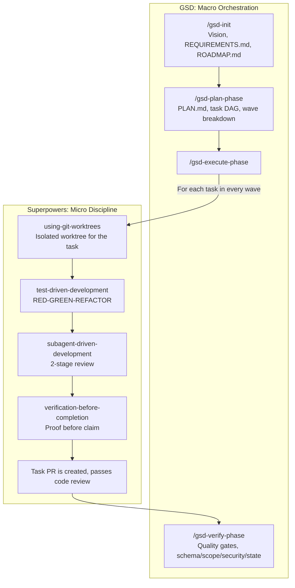

If you use Claude Code for complex monorepos, you are likely familiar with "context rot." Once an LLM session exceeds the 80K+ token mark, output quality often degrades. The model drops architectural context, simplifies requirements, and generates pull requests that are too large to review efficiently.

I realized spec-driven development frameworks help me to solve this issue after tried couple of "frameworks" and methods. My experiments with these two highly effective tools in this space are [GSD](https://github.com/gsd-build/get-shit-done) and [Superpowers](https://github.com/obra/superpowers). While they might appear to serve similar purposes, they operate on different abstraction levels, making them a powerful combination for serious engineering workflows.

### The Abstraction Gap: Macro vs. Micro

First of all if we need to understand why this combination works, we need to look at their distinct roles in the development lifecycle.

**GSD: The Macro Orchestrator**

GSD addresses context rot through structural isolation. It divides the project into manageable phases (Initialize, Discuss, Plan, Execute, Verify). In the planning phase, it maps a [DAG](https://www.datacamp.com/blog/what-is-a-dag) of your tasks and groups independent tasks into execution waves.
- **Core Mechanism:** During execution, GSD provides the LLM with a fresh, zero-token context window containing only the specific task description and relevant files. This prevents the LLM from processing unnecessary project history.

**Superpowers: The Micro Executor**

Superpowers focuses entirely on task-level engineering hygiene, independent of the broader project roadmap.
- **Core Mechanism:** It enforces strict development standards at the tool level. It requires isolated Git worktrees, focuses TDD (RED-GREEN-REFACTOR), and performs a subagent code review before marking any task as complete.

### The Advantage of Combining Both
GSD excels at planning execution waves, but it does not strictly govern code quality; it simply requests the completed task. Conversely, Superpowers enforces clean, atomic commits but lacks awareness of broader domain boundaries or task sequencing. 

On that point GSD orchestrates the waves, and Superpowers enforces the technical discipline within them.

### A Real-World Scenario: The Metered Billing Pivot

Let's consider a SaaS MVP that just launched with a simple flat-rate subscription model. Suddenly, the business requirements change: “We need to switch to usage-based (metered) billing based on API consumption.”

If you feed this into a standard AI chat session, it will likely break your existing Stripe webhooks or corrupt active user subscriptions. Here is how the combined workflow handles the pivot gracefully:

- **The Macro Pivot (GSD)**: You update STATE.md with the new billing scope. GSD plans a new path, leaving the old code untouched for now. It generates a PLAN.md that includes:
   - Wave 1: Update DB Schema to safely deprecate flat pricing and introduce a usage_events table.
- **The Micro Execution (Superpowers)**: GSD triggers Wave 1 and hands execution to Superpowers. Superpowers creates an isolated branch (`feature/metered-billing-schema`), forces the AI to write failing tests for the new usage logging logic, and implements the migration. A subagent reviews the code to verify details, such as ensuring data integrity for legacy users during the transition.
- **The Clean Handoff**: Superpowers finalizes an atomic commit. GSD resumes, runs its verification phase to check for scope drift, and smoothly initiates Wave 2 (updating the payment gateway integration).

### The Workflow Model

When mapped out, the separation of concerns becomes clear. You can adapt this workflow to fit your own needs. For instance, rather than running these commands one by one, I use a custom command file that automates the process. You could also wrap this into a dedicated agent or turn it into a reusable skill; it ultimately depends on your personal preferences and development setup. 

Here is what the macro-to-micro execution looks like in practice:

### Conclusion

Requirements inevitably change during development. By using GSD for macro-level context isolation and Superpowers for micro-level Git and TDD discipline, you can maintain reviewable pull requests, atomic commits, and a resilient architecture, even during major schema shifts.
